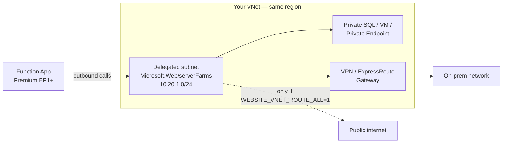

# Azure Functions Overview

> **What is Azure Functions?**

Azure Functions is a **serverless, event-driven compute service** that lets you run small units of code without provisioning or managing servers.

Core capabilities include:

- **Triggers & Bindings** (HTTP, Timer, Queue, Blob, Event Grid, Service Bus, Cosmos DB, etc.)
- **Consumption, Premium and Dedicated (App Service) plans** for different scale, cost and cold-start trade-offs
- **Durable Functions** for stateful orchestration workflows
- **Regional VNet Integration & Private Endpoints** for hybrid/on-prem connectivity
- **Managed Identity** for secretless access to Azure resources
- **Application Insights integration** for monitoring, logging and alerting

---

## 📦 What's in this repo

| Path | What it is |
| ---- | ---------- |
| [scripts/01-Demo-HelloWorld-Function.ps1](scripts/01-Demo-HelloWorld-Function.ps1) | Smoke test — proves a new Function App runs an HTTP-triggered function |
| [scripts/02-Demo-ManagedIdentity-StartStopVMs.ps1](scripts/02-Demo-ManagedIdentity-StartStopVMs.ps1) | Start/stop VMs by tag using a Managed Identity |
| [scripts/03-Demo-Webhook-Function.ps1](scripts/03-Demo-Webhook-Function.ps1) | Function that receives a webhook/Event Grid-style payload |
| [scripts/04-Demo-Webhook-Trigger.ps1](scripts/04-Demo-Webhook-Trigger.ps1) | Client script that fires the function over HTTP |
| [scripts/05-Demo-VNetIntegration-Function.ps1](scripts/05-Demo-VNetIntegration-Function.ps1) | Inventory + internal connectivity test, run from a VNet-integrated function |
| [scripts/06-Setup-FunctionApp.ps1](scripts/06-Setup-FunctionApp.ps1) | Builds the whole lab: storage, identity, RBAC, App Insights, Function App, functions |
| [scripts/07-Setup-VNetIntegration.ps1](scripts/07-Setup-VNetIntegration.ps1) | Configures Regional VNet Integration for hybrid connectivity |
| [workbooks/Function-Monitoring.workbook.json](workbooks/Function-Monitoring.workbook.json) | Azure Monitor workbook for invocation monitoring |
| [workbooks/Monitor-Workbook-Setup-Guide.md](workbooks/Monitor-Workbook-Setup-Guide.md) | Step-by-step guide for deploying that workbook |
| [docs/Storage-Private-Endpoints.md](docs/Storage-Private-Endpoints.md) | Running a Function App when the storage account has public network access **disabled** |

Every script carries full comment-based help — run `Get-Help .\script.ps1 -Full` for parameters and examples.

---

## ✅ Pre-requisites

- An **Azure Subscription**
- **Permissions**:
  - *Owner* or *Contributor* (initial setup)
  - Use **Website Contributor** for scoped, day-to-day access
- **Storage Account** — required by every Function App for triggers and state
- **System-Managed Identity** for secretless access to Azure resources
- **Application Insights** (if you want monitoring, alerting or the workbook)

---

## 💰 Pricing

| Resource                     | Pricing Example                                         |
| ----------------------------- | -------------------------------------------------------- |
| **Consumption Plan**          | Free grant: 1M executions + 400,000 GB-s/month, then ~\$0.20/million executions |
| **Premium Plan (EP1)**        | ~\$0.173/hr per vCPU, always-warm instances               |
| **Dedicated (App Service) Plan** | Standard App Service Plan pricing (e.g. ~\$0.018/hr for B1) |
| **Storage Account**           | ~\$0.02/GB, plus transaction costs                         |
| **Application Insights**      | ~\$2.76/GB (UK South pricing)                              |

> 🔹 Tip: Always factor **Application Insights ingestion** into cost estimates — chatty logging is often the biggest contributor.

---

## 🔐 Permissions Model

| Task                         | Role Required                   |
| ----------------------------- | -------------------------------- |
| Create Function App           | Owner / Contributor              |
| Author / Deploy Functions      | Website Contributor              |
| View Invocation Logs / Outputs | Reader / Monitoring Reader       |
| Manage App Settings           | Website Contributor              |
| Configure VNet Integration     | Network Contributor + Website Contributor |
| Manage Application Insights   | Monitoring Contributor           |

---

## 🛠️ Setting up Azure Functions

1. **Create a Storage Account** in the desired region (mandatory backing store)
2. **Create a Function App** on the plan that fits your workload (Consumption, Premium, Dedicated)
3. **Enable System-Managed Identity** and assign least-privilege RBAC
4. **Link Application Insights** for invocation logs, monitoring and alerting
5. **Author Functions** (PowerShell, C#, Python, Java, Node.js, or Durable Functions)
   - Deploy via zip deploy, Azure Functions Core Tools, or CI/CD
6. **Configure triggers and bindings**, then test and monitor

---

## 📚 Types of Triggers

| Trigger Type      | Notes                                                          |
| ------------------ | --------------------------------------------------------------- |
| **HTTP**           | Request/response APIs and webhooks; secured by function keys or Entra ID |
| **Timer**          | Cron-like scheduled execution                                   |
| **Queue Storage**  | Reliable, decoupled background processing                       |
| **Blob Storage**   | React to blob create/update events                               |
| **Event Grid**     | Native pub/sub for Azure resource and custom events              |
| **Service Bus**    | Enterprise messaging with queues and topics                      |
| **Cosmos DB**      | React to the change feed                                         |
| **Durable Functions** | Stateful orchestration across multiple function calls          |

---

## 🌍 Real-world Scenarios

| Scenario                        | Description                                               |
| -------------------------------- | ------------------------------------------------------------ |
| **API Backend**                  | Lightweight REST APIs behind API Management or Front Door     |
| **Scheduled Cleanup Jobs**       | Timer-triggered housekeeping (stale data, expired resources)  |
| **Event-driven Processing**      | Blob upload triggers resize/transcode/validation pipelines    |
| **Webhook Receiver**             | Ingest GitHub, Stripe, Teams or Power Automate callbacks       |
| **IoT Telemetry Processing**     | Event Hubs/IoT Hub trigger feeding downstream analytics        |
| **Durable Orchestration**        | Multi-step workflows with fan-out/fan-in and human approval    |
| **Data Pipeline Glue**           | Lightweight ETL/transform steps between services              |

---

## 🌐 Regional VNet Integration (Hybrid Connectivity)

By default a Function App lives on shared, multi-tenant App Service infrastructure and talks to everything over the **public internet** — even to resources sitting in your own subscription. **Regional VNet Integration** changes that: it gives the app an outbound network interface inside *your* VNet, so calls to private resources leave from a private IP in your address space.

> 🔹 "Regional" means the VNet must be in the **same region** as the Function App. The older *gateway-required* VNet Integration handled cross-region and is legacy — don't build anything new on it.

### What it does and doesn't do

| | |
| ---- | ---- |
| ✅ **Outbound** calls from your code reach private IPs — VMs, SQL MI, internal load balancers, private endpoints, on-prem over VPN/ExpressRoute | ❌ It does **not** make the Function App itself private. `https://<app>.azurewebsites.net` stays publicly reachable |
| ✅ Traffic is sourced from the delegated subnet, so on-prem firewalls only ever see your VNet's address space | ❌ It is **not** a private endpoint. To restrict *inbound* traffic you need a Private Endpoint on the app, or access restrictions |
| ✅ Works across **peered** VNets and hub-and-spoke topologies | ❌ **Not supported on the Consumption (Y1) plan** — Premium (EP1+), Dedicated, or Flex Consumption only |

Inbound and outbound are two separate problems. VNet Integration solves outbound; Private Endpoints solve inbound. Most "locked down" designs use both.

### How it works



The delegation to `Microsoft.Web/serverFarms` is what tells Azure this subnet is reserved for App Service outbound NICs. A delegated subnet **cannot** host anything else — no VMs, no private endpoints. Always create a second, undelegated subnet for those.

### Setting it up

1. **Confirm the plan.** Premium (EP1+), Dedicated (App Service), or Flex Consumption. On classic Consumption there is no workaround — you must scale up first.
2. **Create a VNet with a subnet delegated to `Microsoft.Web/serverFarms`**, in the same region as the app.
3. **Enable Regional VNet Integration** on the Function App — *Networking* → *Outbound traffic* → **VNet integration**.
4. **Decide how much traffic to route.** By default only **RFC1918 private ranges** (10/8, 172.16/12, 192.168/16) plus service endpoints go down the VNet; everything else still exits over the public internet.
5. **Validate** connectivity to an internal resource from inside a function.

```powershell
.\scripts\07-Setup-VNetIntegration.ps1 -ResourceGroup rg-functionapps-bootcamp `
    -FunctionAppName func-bootcamp-1234 -RouteAllThroughVNet
```

### Subnet sizing — get this right first time

You **cannot resize a subnet that already has integration on it** without tearing the integration down. Plan for peak scale-out:

| Subnet size | Usable IPs | Realistic max instances |
| ----------- | ---------- | ----------------------- |
| /28 | 11 | ~10 — too tight for anything but a demo |
| /26 | 59 | Minimum recommended for Premium |
| /24 | 251 | Comfortable, and what most production apps use |

Azure reserves **5 addresses** in every subnet, and Premium plans consume an IP per instance while scaling — including briefly during deployments and slot swaps.

### The app settings that actually matter

| Setting | Effect |
| ------- | ------ |
| `WEBSITE_VNET_ROUTE_ALL = 1` | Routes **all** outbound traffic through the VNet, not just RFC1918. Required if you want NSGs, UDRs, Azure Firewall or forced tunnelling to apply to internet-bound calls |
| `WEBSITE_CONTENTOVERVNET = 1` | Mounts the Azure Files content share over the VNet — mandatory when the storage account is locked down |
| `WEBSITE_DNS_SERVER` | Points the app at a custom DNS server (e.g. a hub DNS VM or DNS Private Resolver) instead of Azure-provided DNS |

> 🔹 `vnetRouteAllEnabled` on the site config is the newer equivalent of `WEBSITE_VNET_ROUTE_ALL`. Setting either works; setting both to conflicting values does not.

### DNS is the usual culprit

Integration gives you a *route*. It does not give you *name resolution*. If your function resolves `sql-internal.database.windows.net` to a public IP, the private route never gets used. You need either Azure Private DNS zones linked to the VNet, or a custom DNS server reachable from the integration subnet via `WEBSITE_DNS_SERVER`.

Diagnose from the Kudu console (`https://<app>.scm.azurewebsites.net` → Debug console → CMD):

```
nameresolver sql-internal.database.windows.net
tcpping sql-internal.database.windows.net:1433
```

`nameresolver` should return a private IP. If it doesn't, fix DNS before touching anything else.

### Controlling the traffic once it's in the VNet

- **NSGs** on the delegated subnet filter outbound traffic — but only traffic that is actually routed through the VNet, so pair with `WEBSITE_VNET_ROUTE_ALL=1`.
- **UDRs** can force-tunnel everything to an **Azure Firewall** or NVA for inspection and egress logging.
- **Service endpoints** on the delegated subnet let you allow-list that subnet on a storage account or SQL server firewall, as a lighter-weight alternative to private endpoints.

### Common gotchas

| Symptom | Cause |
| ------- | ----- |
| Integration option greyed out | App is on the Consumption (Y1) plan |
| "Subnet is not delegated" | Missing `Microsoft.Web/serverFarms` delegation |
| Can reach 10.x resources but not a public API through the firewall | `WEBSITE_VNET_ROUTE_ALL` not set to `1` |
| Resolves to a public IP | Private DNS zone not linked to the VNet |
| Scale-out stalls under load | Integration subnet ran out of IPs |
| App still publicly reachable after integrating | Expected — that's inbound. Add a Private Endpoint or access restrictions |

### Where to go next

The most common real-world use of this is locking down the Function App's own storage account. See [docs/Storage-Private-Endpoints.md](docs/Storage-Private-Endpoints.md) for the full walkthrough of running with **Public network access = Disabled**.

---

## 📊 Monitoring, Alerts & Reporting

With **Application Insights**, you can:

- Track invocation counts, durations and outcomes
- Detect failures and trigger alerts
- Build custom dashboards in **Power BI** or **Azure Workbooks**
- Export reports to Storage, Email or Teams

**Sample KQL Query:**

```kusto
requests
| summarize Invocations = count() by resultCode, bin(timestamp, 1h)
```

> 🔹 `success` is `"True"` or `"False"` on every row in `requests`; `operation_Id` correlates every telemetry item belonging to a single invocation.

---

## 📈 Monitoring Functions with an Azure Monitor Workbook

Invocation history in the portal only covers a handful of runs at a time and is scoped to one Function App. A **workbook** gives you a single pinnable dashboard across every Function App and Application Insights resource.

This repo ships a ready-made one:

| File | Purpose |
| ---- | ------- |
| [workbooks/Function-Monitoring.workbook.json](workbooks/Function-Monitoring.workbook.json) | The workbook template — paste into the Advanced Editor or deploy via Bicep |
| [workbooks/Monitor-Workbook-Setup-Guide.md](workbooks/Monitor-Workbook-Setup-Guide.md) | Full walkthrough: linking App Insights, import, parameters, alerting, troubleshooting |

**What it reports**

| Tile | Answers |
| ---- | ------- |
| Invocations by outcome | How many succeeded or failed? |
| Invocations over time | Is the failure rate trending up? |
| Failure rate by function | Which function is the problem child? |
| Recent exceptions | What was the actual error message? |
| Longest running invocations | What's driving my execution-time billing? |
| Invocations by instance | How wide is the Function App scaling out? |

**Quick start**

1. **Link Application Insights.** Function App → *Settings* → **Application Insights** → *Turn on Application Insights*. Nothing appears in `requests` until you do this.

   ```powershell
   $appInsights = New-AzApplicationInsights -ResourceGroupName 'rg-functionapps-bootcamp' `
       -Name 'appi-func-bootcamp' -Location 'uksouth' -Kind 'web'

   Update-AzFunctionAppSetting -ResourceGroupName 'rg-functionapps-bootcamp' -Name 'func-bootcamp' `
       -AppSetting @{ 'APPLICATIONINSIGHTS_CONNECTION_STRING' = $appInsights.ConnectionString } -Force
   ```

2. **Import the workbook.** Portal → **Monitor** → **Workbooks** → **+ New** → **`</>` Advanced Editor** → paste the contents of `Function-Monitoring.workbook.json` → **Apply** → **Save**.

3. **Set the pills** at the top: time range, Application Insights resource (multi-select), and function filter. Save again so they stick.

4. **Pin tiles** to an Azure dashboard, or share the workbook — viewers need `Monitoring Reader` on the Application Insights resource, not just workbook access.

> 🔹 Chatty `Write-Host`/`Write-Verbose` output lands in `traces` and is usually the bulk of the ingestion bill. If cost bites, configure **sampling** in `host.json` — you keep the invocation and failure tiles, you just lose some trace granularity.

**Then alert on it.** A dashboard tells you after you look; an alert tells you straight away. Create a log search alert on:

```kusto
requests
| where success == "False"
| summarize Failures = count() by name
```

Fire when `Failures > 0`, evaluated every 5 minutes over a 15-minute window. The action group can even trigger another function via webhook — see [scripts/03-Demo-Webhook-Function.ps1](scripts/03-Demo-Webhook-Function.ps1).

---

## 🏆 Best Practices

- **Use Managed Identities**: Avoid connection strings/secrets where possible, reduces secret management.
- **Keep Functions Small & Single-Purpose**: Easier to test, deploy and reason about independently.
- **Use Durable Functions for Orchestration**: Avoid chaining synchronous HTTP calls for multi-step workflows.
- **Version Control & CI/CD**: Store function code in GitHub/Azure Repos and automate deployment with pipelines.
- **Choose the Right Plan**: Consumption for spiky/low-traffic workloads, Premium for VNet Integration and no cold starts.
- **Monitor Costs**: Track Application Insights ingestion; use sampling and optimize queries.
- **Limit Permissions**: Apply least-privilege RBAC at Function App and resource scopes.
- **Error Handling & Logging**: Always include try/catch and structured logging for invocations.
- **Idempotent Design**: Triggers can retry or redeliver — design functions to be safely re-runnable.
- **Test in a Non-Prod Slot First**: Validate changes in a deployment slot before swapping into production.

---
