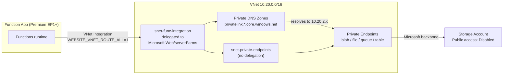

# 🔒 Locked-down Storage: Running a Function App with Public Network Access Disabled

> **Scenario:** Security policy says the Function App's storage account must have
> **Public network access = Disabled**. The moment you flip that switch on a normal
> Function App, the app stops working. This guide explains why, and how to make it
> work properly with **Private Endpoints**.

---

## 💥 Why the Function App breaks

Every Function App keeps far more than your code in its storage account. The
runtime itself depends on it, over four different sub-resources:

| Sub-resource | What the runtime uses it for |
| ------------ | ---------------------------- |
| **blob**  | Lease blobs for singleton/timer locks, Durable Functions state, deployment package (`WEBSITE_RUN_FROM_PACKAGE`) |
| **file**  | The content share (`WEBSITE_CONTENTAZUREFILECONNECTIONSTRING`) — where your function code actually lives on Windows Consumption/Premium |
| **queue** | Durable Functions control/work-item queues, internal scale signalling |
| **table** | Durable Functions history and instance tables, Function App metadata |

Disable public access and all four are unreachable from the App Service platform's
shared outbound infrastructure. Symptoms you'll see:

- Function App shows **"Azure Functions runtime is unreachable"**
- Functions list is empty in the portal
- `AzureWebJobsStorage` errors in Application Insights `traces`
- Timer triggers silently never fire (they can't take the lease blob)

The fix is not to re-enable public access. It's to give the Function App a
**private path** into the storage account.

---

## 🧩 What you actually need

Four things, and all four are mandatory:

1. **A Premium (EP1+), Dedicated, or Flex Consumption plan.**
   Regional VNet Integration is the mechanism that gives the app a private outbound
   path — and the classic **Consumption (Y1) plan does not support it**. There is no
   workaround; you must move off Y1.
2. **Regional VNet Integration** enabled on the Function App, with
   `WEBSITE_VNET_ROUTE_ALL = 1` so storage traffic actually goes down the VNet.
3. **Private Endpoints** for **all four** sub-resources (blob, file, queue, table).
   Creating only the blob one is the single most common mistake — the app will still
   fail to mount its content share.
4. **Private DNS zones** linked to the VNet, so
   `mystorage.blob.core.windows.net` resolves to the private IP rather than the
   public one. Private Endpoints without DNS do nothing useful.

---

## 🗺️ How the traffic flows



Two separate subnets: the **delegated** integration subnet is the app's way *out*,
and an ordinary **undelegated** subnet holds the private endpoint NICs. Never put
private endpoints in the delegated subnet.

---

## 🔢 Order of operations (this matters)

Do it in this order or you'll lock yourself out of a running app:

| Step | Action | Why this order |
| ---- | ------ | -------------- |
| 1 | Move the app to Premium/Dedicated/Flex | VNet Integration is unavailable otherwise |
| 2 | Create the VNet + both subnets | Nothing else can be wired up first |
| 3 | Enable Regional VNet Integration | Gives the app an outbound path |
| 4 | Set `WEBSITE_VNET_ROUTE_ALL=1` and `WEBSITE_CONTENTOVERVNET=1` | Without these, storage traffic still leaves publicly |
| 5 | Create the 4 private endpoints | Private IPs now exist |
| 6 | Create + link the 4 private DNS zones | Names now resolve privately |
| 7 | **Verify resolution from the app** (see below) | Prove it works *before* the point of no return |
| 8 | **Only now** disable public network access | Reversible mistake becomes an outage if you skip step 7 |

---

## ⚙️ Walkthrough

### 1. Subnets

The integration subnet must be delegated to `Microsoft.Web/serverFarms`; the
private endpoint subnet must **not** be delegated.

```powershell
$rg       = 'rg-functionapps-bootcamp'
$location = 'uksouth'
$vnetName = 'vnet-functionapps-bootcamp'

$delegation = New-AzDelegation -Name 'delegation-serverfarms' `
    -ServiceName 'Microsoft.Web/serverFarms'

$snetIntegration = New-AzVirtualNetworkSubnetConfig `
    -Name 'snet-func-integration' -AddressPrefix '10.20.1.0/24' -Delegation $delegation

$snetPrivate = New-AzVirtualNetworkSubnetConfig `
    -Name 'snet-private-endpoints' -AddressPrefix '10.20.2.0/24'

$vnet = New-AzVirtualNetwork -ResourceGroupName $rg -Name $vnetName `
    -Location $location -AddressPrefix '10.20.0.0/16' `
    -Subnet $snetIntegration, $snetPrivate
```

> 🔹 Size the integration subnet at **/26 minimum** (/24 is more comfortable) —
> Premium plans burn one IP per instance while scaling, and Azure reserves five
> addresses in every subnet.

### 2. VNet Integration and the app settings that make it count

`07-Setup-VNetIntegration.ps1` in this repo does the integration itself. The two
settings below are what force storage traffic down that path:

```powershell
$functionAppName = 'func-bootcamp-1234'

Update-AzFunctionAppSetting -ResourceGroupName $rg -Name $functionAppName -Force -AppSetting @{
    'WEBSITE_VNET_ROUTE_ALL' = '1'   # send ALL outbound traffic through the VNet
    'WEBSITE_CONTENTOVERVNET' = '1'  # mount the content file share over the VNet
}
```

`WEBSITE_CONTENTOVERVNET=1` is the one people miss. Without it the platform still
tries to reach the Azure Files content share over the public endpoint, and the app
comes up with no functions in it.

### 3. Private endpoints — all four sub-resources

```powershell
$storageName = 'stfuncbc12345'
$storage     = Get-AzStorageAccount -ResourceGroupName $rg -Name $storageName
$vnet        = Get-AzVirtualNetwork -ResourceGroupName $rg -Name $vnetName
$peSubnet    = $vnet.Subnets | Where-Object Name -eq 'snet-private-endpoints'

foreach ($sub in 'blob', 'file', 'queue', 'table') {

    $connection = New-AzPrivateLinkServiceConnection `
        -Name                 "plsc-$storageName-$sub" `
        -PrivateLinkServiceId $storage.Id `
        -GroupId              $sub

    New-AzPrivateEndpoint `
        -ResourceGroupName             $rg `
        -Name                          "pe-$storageName-$sub" `
        -Location                      $location `
        -Subnet                        $peSubnet `
        -PrivateLinkServiceConnection  $connection `
        -Force | Out-Null

    Write-Host "Private endpoint created for '$sub'" -ForegroundColor Green
}
```

### 4. Private DNS zones (the step that's usually the actual bug)

A private endpoint gives you a private IP. It does **not** change what
`mystorage.blob.core.windows.net` resolves to. That's DNS's job:

```powershell
foreach ($sub in 'blob', 'file', 'queue', 'table') {

    $zoneName = "privatelink.$sub.core.windows.net"

    $zone = New-AzPrivateDnsZone -ResourceGroupName $rg -Name $zoneName

    New-AzPrivateDnsVirtualNetworkLink `
        -ResourceGroupName $rg -ZoneName $zoneName `
        -Name "link-$vnetName" -VirtualNetworkId $vnet.Id | Out-Null

    $pe = Get-AzPrivateEndpoint -ResourceGroupName $rg -Name "pe-$storageName-$sub"

    $config = New-AzPrivateDnsZoneConfig -Name $zoneName -PrivateDnsZoneId $zone.ResourceId

    New-AzPrivateDnsZoneGroup `
        -ResourceGroupName    $rg `
        -PrivateEndpointName  $pe.Name `
        -Name                 'default' `
        -PrivateDnsZoneConfig $config -Force | Out-Null
}
```

Behind the scenes, `mystorage.blob.core.windows.net` becomes a CNAME to
`mystorage.privatelink.blob.core.windows.net`, and the private zone answers that
with `10.20.2.x`. Nothing in your code or connection strings changes.

> 🔹 If you run a **custom DNS server** (common with hub-and-spoke or on-prem
> forwarding), the private zone must be reachable from it — typically by forwarding
> `*.core.windows.net` to `168.63.129.16` from the DNS VM, and setting
> `WEBSITE_DNS_SERVER` on the Function App.

### 5. Verify **before** you lock the door

From the Function App's **Kudu console** (`https://<app>.scm.azurewebsites.net`,
Debug console → CMD):

```
nameresolver mystorage.blob.core.windows.net
tcpping mystorage.blob.core.windows.net:443
```

`nameresolver` must return a **10.20.2.x** address. If it returns a public IP,
your DNS zone link or zone group is wrong — fix it now, not after step 6.

### 6. Disable public network access

```powershell
Update-AzStorageAccountNetworkRuleSet -ResourceGroupName $rg -Name $storageName `
    -DefaultAction Deny

Set-AzStorageAccount -ResourceGroupName $rg -Name $storageName `
    -PublicNetworkAccess Disabled
```

Restart the Function App and confirm the functions list repopulates.

---

## 🪪 Bonus: drop the storage keys entirely

Private endpoints solve the *network* path. Identity-based connections solve the
*secret* problem. Replace the `AzureWebJobsStorage` connection string with the
Managed Identity:

```powershell
$functionApp = Get-AzFunctionApp -ResourceGroupName $rg -Name $functionAppName
$principalId = $functionApp.IdentityPrincipalId

foreach ($role in 'Storage Blob Data Owner', 'Storage Queue Data Contributor', 'Storage Table Data Contributor') {
    New-AzRoleAssignment -ObjectId $principalId -RoleDefinitionName $role -Scope $storage.Id -ErrorAction SilentlyContinue | Out-Null
}

Update-AzFunctionAppSetting -ResourceGroupName $rg -Name $functionAppName -Force -AppSetting @{
    'AzureWebJobsStorage__accountName' = $storageName
}

Remove-AzFunctionAppSetting -ResourceGroupName $rg -Name $functionAppName -AppSettingName 'AzureWebJobsStorage' -Force
```

> 🔹 The **Windows** content share (`WEBSITE_CONTENTAZUREFILECONNECTIONSTRING`)
> still needs a key today. If a fully keyless setup is the requirement, use
> **Flex Consumption** or a **Linux** plan with `WEBSITE_RUN_FROM_PACKAGE` pointing
> at a blob URL, which supports identity-based access.

---

## 🧯 Troubleshooting

| Symptom | Likely cause |
| ------- | ------------ |
| "Azure Functions runtime is unreachable" | Missing **file** private endpoint, or `WEBSITE_CONTENTOVERVNET` not set |
| Functions list empty, app otherwise up | Content share unreachable — same as above |
| `nameresolver` returns a public IP | Private DNS zone not linked to the VNet, or no DNS zone group on the endpoint |
| Works from a VM in the VNet, not from the app | `WEBSITE_VNET_ROUTE_ALL` not set to `1` |
| Durable Functions hang or never start | **queue**/**table** private endpoints missing |
| Zip deploy fails with 403 | Deployment storage blocked — deploy from a self-hosted agent inside the VNet, or add a resource instance rule |
| Timer trigger never fires | Lease blob unreachable — **blob** private endpoint or DNS |
| Everything broke right after enabling | You did step 8 before step 7. Re-enable public access, verify, retry |

**Exceptions worth knowing:** if you need a specific Azure service (Event Grid,
Logic Apps, a deployment pipeline) to keep reaching the storage account, prefer a
**resource instance rule** over re-opening the firewall:

```powershell
Add-AzStorageAccountNetworkRule -ResourceGroupName $rg -Name $storageName `
    -TenantId (Get-AzContext).Tenant.Id `
    -ResourceId $functionApp.Id
```

---

## 💰 Cost note

Private endpoints are billed **per endpoint per hour plus data processed** — four
sub-resources means four endpoints, so budget accordingly. Private DNS zones are
charged per zone and per million queries, which is negligible by comparison. Add
this to the Premium plan uplift you already paid to leave Consumption behind.

---

## 🔗 Related

| File | Purpose |
| ---- | ------- |
| [scripts/07-Setup-VNetIntegration.ps1](../scripts/07-Setup-VNetIntegration.ps1) | Creates the VNet + delegated subnet and enables integration |
| [scripts/05-Demo-VNetIntegration-Function.ps1](../scripts/05-Demo-VNetIntegration-Function.ps1) | Runs an internal connectivity test from inside a function |
| [Readme.md](../Readme.md) | Main bootcamp guide |
